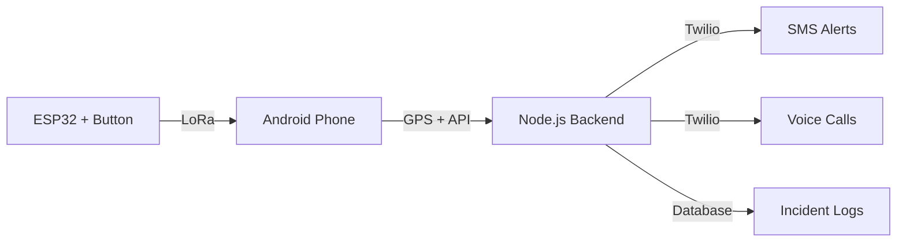

# Women Safety System

An Android-based emergency response system using ESP32 hardware, LoRa communication, and automated alert delivery.

## 🚨 Overview

This system provides a reliable emergency alert mechanism for women's safety:

- **Hardware**: ESP32 with physical emergency button and LoRa communication
- **Mobile**: Android app for receiving alerts and GPS tracking
- **Backend**: Node.js server for SMS/call delivery via Twilio

## ✨ Key Features

- ✅ **3-Second Confirmation Delay** - Prevents false alarms
- ✅ **LoRa Communication** - Works without cellular/Wi-Fi
- ✅ **Automatic GPS Location** - Shares location with emergency contacts
- ✅ **SMS & Voice Calls** - Multi-channel alert delivery
- ✅ **Low Cost** - ~$30-55 per unit
- ✅ **Offline Capable** - LoRa works in low-network environments

## 🏗️ System Architecture



## 📁 Project Structure

```
.
├── esp32-firmware/          # ESP32 C/C++ firmware
│   ├── main.c              # Button logic & LoRa transmission
│   ├── lora_comm.c         # LoRa communication layer
│   ├── lora_comm.h
│   ├── config.h            # Hardware configuration
│   └── platformio.ini      # Build configuration
│
├── android-app/            # Android application
│   └── app/src/main/
│       ├── AndroidManifest.xml
│       └── java/com/safety/womenalert/
│           ├── MainActivity.java
│           ├── LoRaService.java        # Background LoRa listener
│           ├── EmergencyHandler.java   # GPS & API client
│           └── ApiClient.java
│
├── backend/                # Node.js backend
│   ├── server.js          # Express server
│   ├── routes/
│   │   └── emergency.js   # API endpoints
│   ├── services/
│   │   ├── alertService.js    # Twilio SMS/calls
│   │   └── incidentLogger.js  # Database operations
│   ├── models/
│   │   └── Incident.js    # MongoDB schema
│   └── package.json
│
└── docs/
    ├── WORKFLOW.md        # End-to-end workflow
    ├── COMPONENTS.md      # Hardware components list
    ├── API.md            # API documentation
    └── DEPLOYMENT.md     # Deployment guide
```

## 🚀 Quick Start

### 1. Flash ESP32 Firmware

```bash
cd esp32-firmware
pio run --target upload
```

### 2. Build Android App

```bash
cd android-app
./gradlew assembleDebug
adb install app/build/outputs/apk/debug/app-debug.apk
```

### 3. Deploy Backend

```bash
cd backend
npm install
cp .env.example .env
# Edit .env with Twilio credentials
npm start
```

## 📋 Requirements

### Hardware

- **ESP32** development board ($5-10)
- **SX1276 LoRa module** ($3-8)
- **Emergency button** ($1-2)
- **USB LoRa adapter** for Android ($15-30)
- *Optional*: Battery, enclosure

**Total Cost:** ~$30-55 per unit

### Software

- **ESP32 Firmware**: C/C++, PlatformIO/Arduino IDE
- **Android App**: Java, Android Studio, API 24+
- **Backend**: Node.js 16+, Express, Twilio

## 🔧 Configuration

### ESP32 (`config.h`)

```c
#define DEVICE_ID           0x0001    // Unique per device
#define LORA_FREQUENCY      868E6     // 868MHz (EU) or 915MHz (US)
```

### Android App

1. Grant permissions (Location, SMS, Phone, USB)
2. Connect USB LoRa adapter
3. Configure emergency contacts
4. Enter backend URL

### Backend (`.env`)

```bash
TWILIO_ACCOUNT_SID=your_sid
TWILIO_AUTH_TOKEN=your_token
TWILIO_PHONE_NUMBER=+1234567890
```

## 📖 Documentation

- **[WORKFLOW.md](WORKFLOW.md)** - Complete emergency workflow
- **[COMPONENTS.md](COMPONENTS.md)** - Hardware components & costs
- **[API.md](API.md)** - Backend API reference
- **[DEPLOYMENT.md](DEPLOYMENT.md)** - Deployment instructions

## 🌊 Emergency Workflow

1. **Button Press** → 3-second delay starts
2. **Confirm/Cancel** → Second press cancels, timeout confirms
3. **LoRa Packet** → ESP32 sends emergency packet
4. **Android Receives** → Parses packet, gets GPS
5. **Backend API** → Creates incident, sends alerts
6. **Twilio** → Delivers SMS and voice calls
7. **Response Time** → ~7-30 seconds end-to-end

## 🧪 Testing

**Test Emergency Flow:**

```bash
# 1. Monitor ESP32
pio device monitor

# 2. Monitor Android
adb logcat -s LoRaService EmergencyHandler

# 3. Monitor Backend
pm2 logs women-safety

# 4. Trigger emergency
# Press ESP32 button, wait 3 seconds
# Verify alerts delivered
```

## 🔒 Security Considerations

- ✅ Use API authentication (JWT/API keys) in production
- ✅ Encrypt sensitive data in database
- ✅ Validate all inputs server-side
- ✅ Rate limit API endpoints
- ✅ Use HTTPS for all communications
- ✅ Secure Twilio credentials


## 🐛 Troubleshooting

**No LoRa packets received:**
- Check LoRa frequency matches (868/915 MHz)
- Verify antenna connected
- Check USB LoRa adapter on Android

**GPS not working:**
- Enable location services
- Go outdoors for better signal
- System works with (0,0) if GPS fails

**Alerts not sent:**
- Verify Twilio credentials
- Check account balance
- Ensure E.164 phone format (+1234567890)

## 📝 License

MIT License - see LICENSE file for details

## 🤝 Contributing

This is a safety-critical system. Pull requests welcome for:

- Bug fixes
- Documentation improvements
- Performance optimizations
- Additional SMS/call providers

## ⚠️ Disclaimer

This system is designed to assist in emergencies but should not replace local emergency services (911, 112, etc.). Always contact local authorities in life-threatening situations.

## 📞 Support

- Create an issue on GitHub
- Email: [your-email]
- Documentation: See `/docs` folder

---

**Built for women's safety. Designed for reliability. Optimized for panic situations** 🚨
