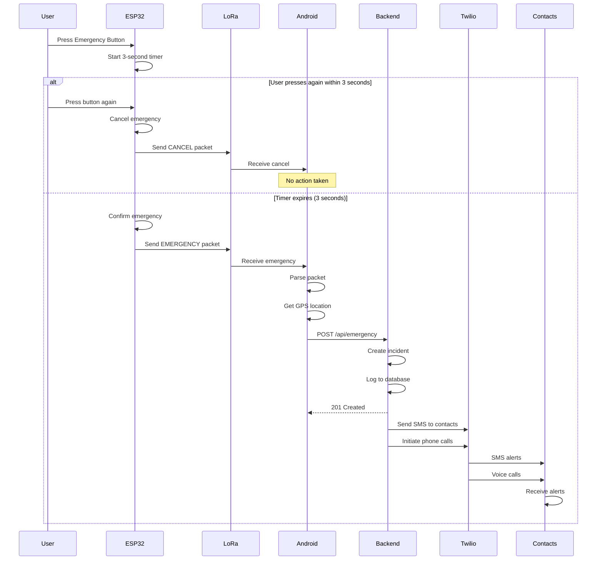

# End-to-End Emergency Workflow

This document describes the complete emergency workflow from button press to alert delivery.

## System Flow Diagram



## Detailed Workflow Steps

### Phase 1: Emergency Detection (ESP32)

1. **Button Press Detection**
   - User presses emergency button
   - GPIO interrupt triggered (FALLING edge)
   - Debounce check (50ms)
   - State changes from `IDLE` to `DELAY`

2. **3-Second Delay Timer**
   - ESP32 starts one-shot timer (3000ms)
   - LED starts blinking (200ms intervals)
   - System waits for either:
     - Timer expiration → Emergency confirmed
     - Second button press → Emergency cancelled

3. **Emergency Confirmed**
   - Timer expires without second press
   - State changes to `CONFIRMED`
   - LED turns solid ON
   - Construct emergency packet:
     ```
     Magic: 0xEF 0xFD
     Device ID: 0x0001
     Type: 0x01 (EMERGENCY)
     Battery: 85%
     Timestamp: 1234
     Sequence: 42
     Checksum: <CRC16>
     ```
   - Transmit packet via LoRa
   - Wait for transmission complete (~50-200ms)
   - Return to `IDLE` state

4. **Emergency Cancelled**
   - User presses button again during delay
   - Stop timer
   - State changes to `CANCELLED`
   - Send CANCEL packet (type: 0x02)
   - LED turns OFF
   - Return to `IDLE` state after 1 second

### Phase 2: LoRa Communication

**ESP32 → LoRa Module → Air → LoRa Receiver → Android**

- **Frequency**: 868 MHz (Europe) / 915 MHz (US)
- **Spreading Factor**: SF7 (faster transmission)
- **Bandwidth**: 125 kHz
- **TX Power**: 20 dBm (maximum)
- **Range**: Up to 2-5 km (urban) / 10-15 km (rural)
- **Transmission Time**: ~50-200ms depending on spreading factor
- **Packet Size**: 12 bytes

### Phase 3: Android Reception & Processing

1. **LoRa Service Listening**
   - Background foreground service running 24/7
   - USB serial connection to LoRa receiver
   - Continuous monitoring for incoming data

2. **Packet Reception**
   - Receive bytes via USB serial (9600 baud)
   - Look for magic bytes: `0xEF 0xFD`
   - Collect 12-byte packet
   - Verify CRC16 checksum
   - Parse packet fields

3. **Packet Validation**
   ```
   If checksum invalid → Discard packet
   If packet type == EMERGENCY → Trigger emergency workflow
   If packet type == CANCEL → Log cancellation
   If packet type == HEARTBEAT → Update device status
   ```

4. **GPS Location Acquisition**
   - Request last known location
   - Try providers in order:
     1. GPS (most accurate)
     2. Network (cell towers/Wi-Fi)
     3. Passive (last cached)
   - Timeout: 10 seconds
   - If no location → Send (0, 0) coordinates

5. **Backend Communication**
   - Construct JSON payload:
     ```json
     {
       "deviceId": 1,
       "latitude": 37.7749,
       "longitude": -122.4194,
       "batteryLevel": 85,
       "sequenceNumber": 42,
       "timestamp": 1705680000000,
       "emergencyContacts": ["+1234567890", "+0987654321"]
     }
     ```
   - POST to `/api/emergency`
   - Timeout: 10 seconds
   - Retry once if failed

### Phase 4: Backend Processing

1. **Emergency Endpoint**
   - Receive POST request
   - Validate required fields
   - Create incident record in database
   - Return 201 Created immediately (don't wait for alerts)

2. **Incident Creation**
   - Generate unique incident ID (UUID)
   - Store in database:
     - Device ID
     - Location (lat/lng)
     - Battery level
     - Timestamp
     - Emergency contacts
     - Status: "triggered"

3. **Asynchronous Alert Sending**
   - Trigger alert service (non-blocking)
   - For each emergency contact:
     - Send SMS with location
     - Initiate phone call
   - Continue in background

### Phase 5: Alert Delivery (Twilio)

1. **SMS Alert**
   ```
   🚨 EMERGENCY ALERT 🚨
   
   A safety alert has been triggered!
   
   Device: 1
   Time: Jan 19, 2026 9:30 PM
   Location: https://maps.google.com/?q=37.7749,-122.4194
   Battery: 85%
   
   This is an automated emergency alert. Please respond immediately.
   ```

2. **Phone Call Alert**
   - TwiML voice message:
   ```
   "Emergency Alert! This is an automated safety alert. 
   An emergency has been triggered from device 1. 
   Latitude 37.7749, Longitude -122.4194. 
   Battery level is 85 percent. 
   Please respond immediately."
   ```
   - Message repeats twice
   - Call duration: 30 seconds

3. **Alert Status Tracking**
   - Record SMS/call SIDs from Twilio
   - Update incident status to "alerts_sent"
   - Calculate response time
   - Store in incident metadata

## Failure Handling

### Network Failures

**Android → Backend connectivity lost:**
- Initial attempt fails
- Wait 2 seconds
- Retry once
- If retry fails → Show local notification
- Keep incident in local queue for later sync

**Backend → Twilio connectivity lost:**
- Alert service catches exception
- Mark incident status as "alert_failed"
- Log error details
- Can be retried manually or automatically

### Hardware Failures

**LoRa transmission failed:**
- ESP32 checks transmission status
- Retry once after 500ms delay
- If still failing → Alert logged locally
- LED pattern indicates error (alternative blinking)

**GPS unavailable:**
- Android sends (0, 0) coordinates
- Backend still processes alert
- SMS includes "Location: Not available"

## False Trigger Detection

**Accidental Activation Prevention:**
1. 3-second delay allows time to cancel
2. Second button press cancels emergency
3. Sequence numbers prevent duplicate processing
4. Battery level tracking for device health

**Backend Intelligence:**
- Track incident frequency per device
- Flag devices with >5 incidents/day
- Alert administrator for investigation
- Can implement cooldown periods

## Performance Metrics

**End-to-End Latency:**
- Button press → LoRa transmission: 3.05 seconds
- LoRa air time: 0.05-0.2 seconds
- Android processing: 0.1-0.5 seconds
- GPS acquisition: 1-10 seconds
- Backend API call: 0.2-1 second
- SMS delivery: 1-5 seconds
- Phone call initiation: 2-5 seconds

**Total Time (best case):** ~7-10 seconds  
**Total Time (worst case):** ~25-30 seconds

## Testing Scenarios

### Scenario 1: Normal Emergency
1. Press button once
2. Wait 3 seconds
3. Verify LoRa packet sent
4. Verify Android receives
5. Verify GPS captured
6. Verify backend receives
7. Verify SMS/calls delivered

### Scenario 2: Cancelled Emergency
1. Press button once
2. Press again within 3 seconds
3. Verify CANCEL packet sent
4. Verify no alerts sent

### Scenario 3: No GPS Signal
1. Disable GPS on Android
2. Trigger emergency
3. Verify alert sent with (0,0) coordinates

### Scenario 4: No Network
1. Enable airplane mode (Android)
2. Trigger emergency
3. Verify local queuing
4. Re-enable network
5. Verify eventual delivery

### Scenario 5: Low Battery
1. Set ESP32 battery to <20%
2. Trigger emergency
3. Verify battery level in SMS alert
